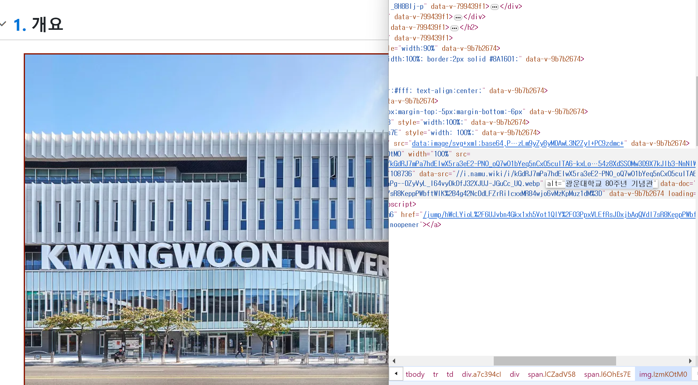
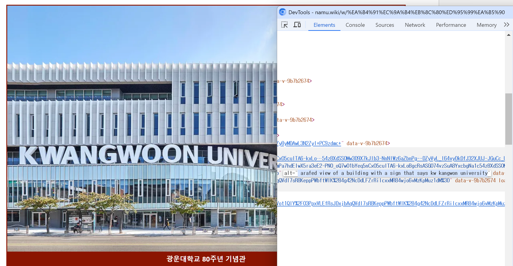
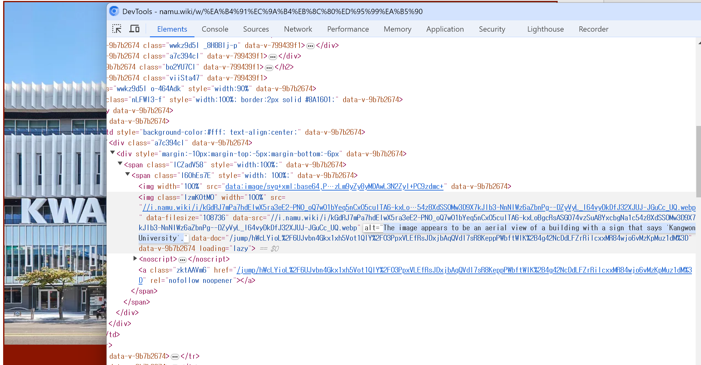

- 현재 alt 문제점
  

  실제로 눈으로 볼 수 있는 이미지 속 정보가 아닌, 이미지 자체에 대한 정보만이 있음.

  

  - 이미지 캡션 모델만 할 경우: `arafed view of a building with a sign that says kw kangwon university`

  

  - 이미지 캡션 모델 + llm: `The image appears to be an aerial view of a building with a sign that says 'Kangwon University'.`

  뭔가 이상한 말 하고있긴 한데 이건 llm 모델 좋은 거 쓰면 해결 될 거로 보임

---

```json
{
  "e52c3a71b2aba22408c3.png": {
    "image_name": "e52c3a71b2aba22408c3.png",
    "response": "The image appears to be a close-up shot of a pair of scissors with the word 'Flooh Lite' written on it, likely related to the article title '광운대학교 - 나무위키'."
  }, // caption model: a close up of a pair of scissors with the word flooh lite
  "aAxwHhomEZG9oCJJ2CfUY7zxEvOeoTVoLVgyh8OZ1NFEffen7IeI80Pc_SrksrcPK3fRcW0IJ8poqwJGT0bz_Q.webp": {
    "image_name": "aAxwHhomEZG9oCJJ2CfUY7zxEvOeoTVoLVgyh8OZ1NFEffen7IeI80Pc_SrksrcPK3fRcW0IJ8poqwJGT0bz_Q.webp",
    "response": "The logo features a blue and black design with a wave in the middle."
  }, // caption model: a blue and black logo with a wave in the middle
  "mZ_XT22NdVnq4zUwujxx3QggG9dgue3IIU9IfUe1RdLFqyOz9gsvZO848GOIggC0FDhcIu_KXf7OSOtNB5_beHZezGHni2jCpYOG2oszeXD0RgdTqXHJYL0eRK4u9nxCcAoLBLrC-ty6AIBC3ck9XA.webp": {
    "image_name": "mZ_XT22NdVnq4zUwujxx3QggG9dgue3IIU9IfUe1RdLFqyOz9gsvZO848GOIggC0FDhcIu_KXf7OSOtNB5_beHZezGHni2jCpYOG2oszeXD0RgdTqXHJYL0eRK4u9nxCcAoLBLrC-ty6AIBC3ck9XA.webp",
    "response": "The image appears to be the logo of Korea University Sports Federation, featuring a combination of blue and white colors with a stylized letter 'K' or a sports-related symbol."
  }, // caption model: korea university sports federation
  "zr6qc9A-n2_LeoWlTLmp04_81_qb8n7Lv-s23htvWFie6KB4VZe1ckbQ8NJxx7szcU7CGfMqhHUFrAgpGZO2sUi8VbbpPVoh0_IboX_ivlcK7QgmNSuyTZ2fhzMCQHSDwBUtCF7gMfR_GIqeu9p0kw.webp": {
    "image_name": "zr6qc9A-n2_LeoWlTLmp04_81_qb8n7Lv-s23htvWFie6KB4VZe1ckbQ8NJxx7szcU7CGfMqhHUFrAgpGZO2sUi8VbbpPVoh0_IboX_ivlcK7QgmNSuyTZ2fhzMCQHSDwBUtCF7gMfR_GIqeu9p0kw.webp",
    "response": "The image appears to be the logo for Gwangwoon University, featuring its name in Korean characters."
  }, // caption model: a logo for the company coss
  "m4iJqW82P8MGKe_KMs6CBr13ZsD3CPcbff73l0-xFvOO9My6HgmUpMUJ_a-rc3cGgE0b2oQzUeYctpKe1Y_aQ064RxRppdVhINvMT9wl2Sv4yjJdpAch2QY-S7KFhFkiM9sIEJAFDmFFdSoSLDvLwQ.webp": {
    "image_name": "m4iJqW82P8MGKe_KMs6CBr13ZsD3CPcbff73l0-xFvOO9My6HgmUpMUJ_a-rc3cGgE0b2oQzUeYctpKe1Y_aQ064RxRppdVhINvMT9wl2Sv4yjJdpAch2QY-S7KFhFkiM9sIEJAFDmFFdSoSLDvLwQ.webp",
    "response": "The image appears to be a statue of a horse in a courtyard with a fountain, likely taken from the campus of Gwangju University."
  }, // caption model: araffe statue of a horse in a courtyard with a fountain
  "kGdRJ7mPa7hdEIwX5ra3eE2-PNO_oQ7wO1bYeq5nCxO5culTA6-kxLoBgcRsASG074vzSuA8YxcbgNa1c54z8XdSS0Mw3D9X7kJIb3-NnNlWz6aZbnPg--DZyVyL_l64vyDkDfJ32XJUJ-JGuCc_UQ.webp": {
    "image_name": "kGdRJ7mPa7hdEIwX5ra3eE2-PNO_oQ7wO1bYeq5nCxO5culTA6-kxLoBgcRsASG074vzSuA8YxcbgNa1c54z8XdSS0Mw3D9X7kJIb3-NnNlWz6aZbnPg--DZyVyL_l64vyDkDfJ32XJUJ-JGuCc_UQ.webp",
    "response": "The image appears to be an aerial view of a building with a sign that says 'Kangwon University'."
  }, // caption model arafed view of a building with a sign that says kw kangwon university
  "31G4y-7SFhMdTeQkV84T7yXzJmrrtiZ5sEFC2xEao4p2rMdLqB4gBEIlayP-nJGyuntVr1sMlELKkxtTBDMQJVL9PiOhu_85CT12twICUrFtw9YPdR0e4caZ5ZwRdkoQp9TwR_N3ojC-5j_NXCJ2Fw.webp": {
    "image_name": "31G4y-7SFhMdTeQkV84T7yXzJmrrtiZ5sEFC2xEao4p2rMdLqB4gBEIlayP-nJGyuntVr1sMlELKkxtTBDMQJVL9PiOhu_85CT12twICUrFtw9YPdR0e4caZ5ZwRdkoQp9TwR_N3ojC-5j_NXCJ2Fw.webp",
    "response": "The image appears to be a black and white photo of a table with numbers and text, likely related to the article title '광운대학교 - 나무위키'."
  }, // caption model: a black and white photo of a table with numbers and numbers
  "8coXkkgGveGGMzYSEpnOehYN1Oppq1DjJ7p1YnA0qVanCICn9sY2is3WOgMvpjTiNFEFkBz41N4Xt6gLVgSe6OI3Znsg-LEKti9-TGTs2GqVd4De9ub2eIMOP2CDpEj8RdUEqinZZwWoPvhD7hrE9w.webp": {
    "image_name": "8coXkkgGveGGMzYSEpnOehYN1Oppq1DjJ7p1YnA0qVanCICn9sY2is3WOgMvpjTiNFEFkBz41N4Xt6gLVgSe6OI3Znsg-LEKti9-TGTs2GqVd4De9ub2eIMOP2CDpEj8RdUEqinZZwWoPvhD7hrE9w.webp",
    "response": "The image appears to be a university campus scene, featuring buildings and greenery."
  } // caption model: a table with a number of different types of food and prices
}
```

table이나 글자가 들어있는 건 이상하게 해석하긴 하는데..
캡션 모델만 쓰는 것보단 훨씬 낫긴 하네

---

gpt3.5 turbo 말고 llama3:8b 쓴다면..?

```json
{
  "e52c3a71b2aba22408c3.png": {
    "image_name": "e52c3a71b2aba22408c3.png",
    "response": "a close up of a pair of scissors with the word flooh lite"
  },
  "aAxwHhomEZG9oCJJ2CfUY7zxEvOeoTVoLVgyh8OZ1NFEffen7IeI80Pc_SrksrcPK3fRcW0IJ8poqwJGT0bz_Q.webp": {
    "image_name": "aAxwHhomEZG9oCJJ2CfUY7zxEvOeoTVoLVgyh8OZ1NFEffen7IeI80Pc_SrksrcPK3fRcW0IJ8poqwJGT0bz_Q.webp",
    "response": "a blue and black logo with a wave in the middle"
  },
  "mZ_XT22NdVnq4zUwujxx3QggG9dgue3IIU9IfUe1RdLFqyOz9gsvZO848GOIggC0FDhcIu_KXf7OSOtNB5_beHZezGHni2jCpYOG2oszeXD0RgdTqXHJYL0eRK4u9nxCcAoLBLrC-ty6AIBC3ck9XA.webp": {
    "image_name": "mZ_XT22NdVnq4zUwujxx3QggG9dgue3IIU9IfUe1RdLFqyOz9gsvZO848GOIggC0FDhcIu_KXf7OSOtNB5_beHZezGHni2jCpYOG2oszeXD0RgdTqXHJYL0eRK4u9nxCcAoLBLrC-ty6AIBC3ck9XA.webp",
    "response": "korea university sports federation"
  },
  "zr6qc9A-n2_LeoWlTLmp04_81_qb8n7Lv-s23htvWFie6KB4VZe1ckbQ8NJxx7szcU7CGfMqhHUFrAgpGZO2sUi8VbbpPVoh0_IboX_ivlcK7QgmNSuyTZ2fhzMCQHSDwBUtCF7gMfR_GIqeu9p0kw.webp": {
    "image_name": "zr6qc9A-n2_LeoWlTLmp04_81_qb8n7Lv-s23htvWFie6KB4VZe1ckbQ8NJxx7szcU7CGfMqhHUFrAgpGZO2sUi8VbbpPVoh0_IboX_ivlcK7QgmNSuyTZ2fhzMCQHSDwBUtCF7gMfR_GIqeu9p0kw.webp",
    "response": "a logo for the company coss"
  },
  "m4iJqW82P8MGKe_KMs6CBr13ZsD3CPcbff73l0-xFvOO9My6HgmUpMUJ_a-rc3cGgE0b2oQzUeYctpKe1Y_aQ064RxRppdVhINvMT9wl2Sv4yjJdpAch2QY-S7KFhFkiM9sIEJAFDmFFdSoSLDvLwQ.webp": {
    "image_name": "m4iJqW82P8MGKe_KMs6CBr13ZsD3CPcbff73l0-xFvOO9My6HgmUpMUJ_a-rc3cGgE0b2oQzUeYctpKe1Y_aQ064RxRppdVhINvMT9wl2Sv4yjJdpAch2QY-S7KFhFkiM9sIEJAFDmFFdSoSLDvLwQ.webp",
    "response": "araffe statue of a horse in a courtyard with a fountain"
  },
  "kGdRJ7mPa7hdEIwX5ra3eE2-PNO_oQ7wO1bYeq5nCxO5culTA6-kxLoBgcRsASG074vzSuA8YxcbgNa1c54z8XdSS0Mw3D9X7kJIb3-NnNlWz6aZbnPg--DZyVyL_l64vyDkDfJ32XJUJ-JGuCc_UQ.webp": {
    "image_name": "kGdRJ7mPa7hdEIwX5ra3eE2-PNO_oQ7wO1bYeq5nCxO5culTA6-kxLoBgcRsASG074vzSuA8YxcbgNa1c54z8XdSS0Mw3D9X7kJIb3-NnNlWz6aZbnPg--DZyVyL_l64vyDkDfJ32XJUJ-JGuCc_UQ.webp",
    "response": "A bird's-eye view of a building with a sign that says 'Kangwon University.'"
  },
  "31G4y-7SFhMdTeQkV84T7yXzJmrrtiZ5sEFC2xEao4p2rMdLqB4gBEIlayP-nJGyuntVr1sMlELKkxtTBDMQJVL9PiOhu_85CT12twICUrFtw9YPdR0e4caZ5ZwRdkoQp9TwR_N3ojC-5j_NXCJ2Fw.webp": {
    "image_name": "31G4y-7SFhMdTeQkV84T7yXzJmrrtiZ5sEFC2xEao4p2rMdLqB4gBEIlayP-nJGyuntVr1sMlELKkxtTBDMQJVL9PiOhu_85CT12twICUrFtw9YPdR0e4caZ5ZwRdkoQp9TwR_N3ojC-5j_NXCJ2Fw.webp",
    "response": "a black and white photo of a table with numbers and numbers"
  },
  "8coXkkgGveGGMzYSEpnOehYN1Oppq1DjJ7p1YnA0qVanCICn9sY2is3WOgMvpjTiNFEFkBz41N4Xt6gLVgSe6OI3Znsg-LEKti9-TGTs2GqVd4De9ub2eIMOP2CDpEj8RdUEqinZZwWoPvhD7hrE9w.webp": {
    "image_name": "8coXkkgGveGGMzYSEpnOehYN1Oppq1DjJ7p1YnA0qVanCICn9sY2is3WOgMvpjTiNFEFkBz41N4Xt6gLVgSe6OI3Znsg-LEKti9-TGTs2GqVd4De9ub2eIMOP2CDpEj8RdUEqinZZwWoPvhD7hrE9w.webp",
    "response": "The image contains a table with a number of different types of food and prices."
  }
}
```

caption은 똑같은 거 같으니 생략

왜 8b따리 llama가 더 좋은 거 같지
